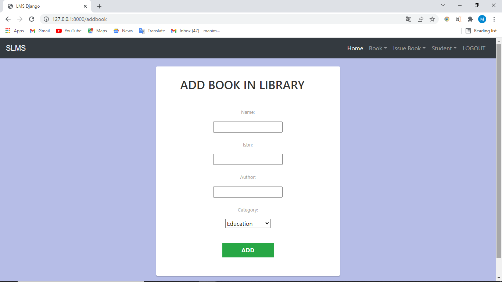
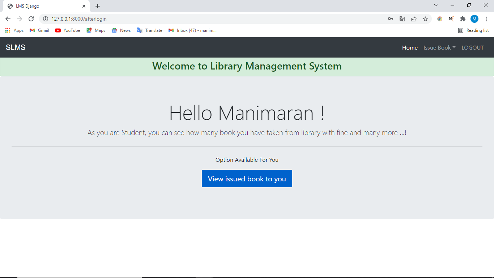

# Library-Management-System-with-FAQ-Bot
A library management system is software that 
is designed to manage all the functions of a 
library. It helps librarian to maintain the 
database of new books and the books that are 
borrowed by members along with their due dates. 
This system completely automates all your 
library's activities.

# Sections
There are two sections in this system. 

## Admin portal

## Signin as Admin

## Login as Admin

## Admin Main Page

## Add books to Library

## View Book

## Issue Book

## Issued Book

## View student

## Student portal
## Student Signup

## Student login

## Student page

## Book issued

# Cloning a repository

1. Open GitHub and go to the GitHub repository that you want to clone.
2. Click “Code” and copy the given URL.

3. Open “Git Bash” and change the current working directory to the location where you want the cloned directory.
4. Type git clone in the terminal, paste the URL you copied earlier, and press “enter” to create your local clone.
### Syntax
    git clone {repository URL}

# To run the application locally:

Navigate into in the application folder:
 
    cd Library-Management-System-with-FAQ-Bot

Create a virtual environment for the app:

    py -m venv .venv
    .venv\scripts\activate

Install the dependencies:
 
    pip install -r requirements.txt

Make the Migrations to store the database:

    python manage.py makemigrations

Migrate:

    python manage.py migrate

Run the app:

    python manage.py runserver

Browse to the sample application at http://localhost:8000 in a web browser.
